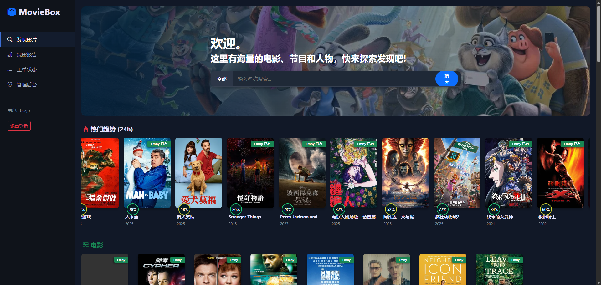
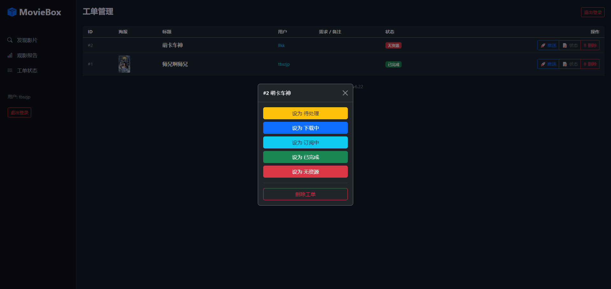
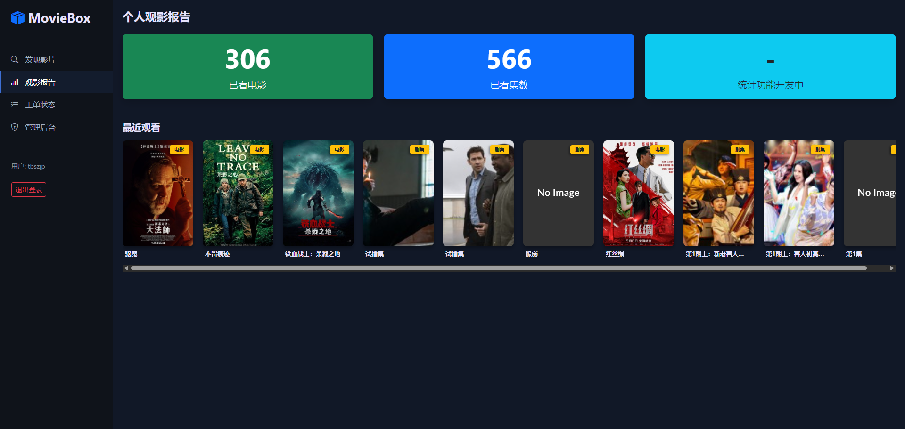

<div align="center">

# 🎬 MovieBox Pro
### 现代化影视求片与媒体管理系统 (Docker Edition)

[](https://hub.docker.com/r/tbslantian/moviebox)
[](https://hub.docker.com/r/tbslantian/moviebox)
[](https://time.is/Shanghai)
[](https://python.org)

**MovieBox Pro** 是一款专为影音爱好者打造的求片管理系统。<br>
它无缝连接 **TMDB**、**Emby** 和 **MoviePilot**，<br>
为您提供优雅的影片发现、状态查询及自动化订阅体验。

[查看 Demo](https://github.com/tbslantian/moviebox) · [报告 Bug](https://github.com/tbslantian/moviebox/issues)

</div>

---

## ✨ 核心特性

- 🎥 **沉浸式发现**  
  基于 TMDB 的热门趋势展示，每日自动更新，配合 Hero 大图背景，视觉体验极佳。

- 🔍 **Emby 状态透视**  
  在浏览或搜索影片时，自动检测 Emby 媒体库。如果库中已存在，直接显示 `Emby 已有` 绿色标签，拒绝重复求片。

- 🚀 **无缝对接 MoviePilot**  
  支持通过账号密码自动登录 MoviePilot 获取实时 Token，一键推送订阅/下载请求（彻底解决 Token 过期问题）。

- ⚡ **极致性能优化**  
  - **图片反代与缓存**：内置 Emby 图片反向代理，自动缓存海报 3 小时，解决内网图片无法加载问题。
  - **后台异步更新**：热门趋势与库存检测采用 "Stale-While-Revalidate" 策略，页面加载毫秒级响应。

- 📱 **全端适配**  
  完美适配移动端，支持侧边栏手势交互，手机管理更轻松。

- 📊 **个人观影报告**  
  基于 Emby 用户数据，生成个人观影统计与最近播放记录。

---

## 📸 界面预览

| 发现首页 (Hero UI) | 详情页 (Emby状态) |
| :---: | :---: |
|  |  |

| 审核工单 | 个人报告 |
| :---: | :---: |
|  |  |

| TG BOT 推送 | 
| :---: | :---: |
|  |


---

## 📦 部署指南 (Docker Compose)

推荐使用 Docker Compose 进行一键部署。

### 1. 创建配置文件
在服务器创建 `docker-compose.yml`：

```yaml
version: '3.8'

services:
  moviebox:
    image: tbslantian/moviebox:latest
    container_name: moviebox
    restart: always
    ports:
      - "9850:9850"
    volumes:
      # 数据持久化
      - ./data:/opt/moviebox/data
      # ⚠️ 群晖/Linux 用户必选：挂载机器码用于授权
      - /etc/machine-id:/etc/machine-id:ro
    environment:
      # --- 授权配置 (必填) ---
      - MB_LICENSE_KEY=你的授权码
      
      # --- 基础配置 ---
      - TZ=Asia/Shanghai
      
      # --- TMDB 配置 ---
      - CFG_API_KEY=你的TMDB_API_KEY
      
      # --- MoviePilot 配置 (自动化订阅) ---
      - CFG_MP_URL=http://192.168.1.x:3000
      - CFG_MP_USER=admin
      - CFG_MP_PWD=password
      
      # --- Emby 配置 (库存检测) ---
      - CFG_EMBY_URL=http://192.168.1.x:8096
      - CFG_EMBY_KEY=你的EmbyApiKey

docker-compose up -d

⚙️ 环境变量详解
变量名	必填	说明
MB_LICENSE_KEY	✅	从管理员处获取的商业授权码
CFG_API_KEY	✅	TMDB API Key，用于获取元数据
CFG_MP_URL	✅	MoviePilot 地址 (例如 http://10.0.0.1:3000)
CFG_MP_USER	✅	MoviePilot 登录用户名
CFG_MP_PWD	✅	MoviePilot 登录密码
CFG_EMBY_URL	✅	Emby 服务器地址 (不带结尾斜杠)
CFG_EMBY_KEY	✅	Emby API Key

📜 免责声明
本项目仅供学习交流与个人媒体库管理使用。
请勿用于非法用途。
所有影片元数据均来自 TMDB，本项目不存储任何视听文件。
Copyright © 2025 tbslantian. All Rights Reserved.


